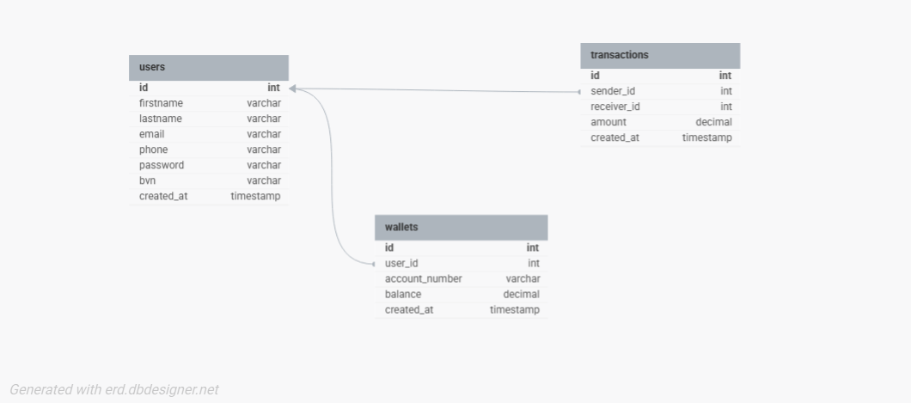

# LendSqr API Demo Credit Wallet Service (Test)

## Overview

This is a Node.js and TypeScript-based microservice MVP API for LendSqr's Demo Credit Wallet. The service supports core wallet operations including creation, funding, transfers, and withdrawals, all secured through JWT authentication and tested using unit tests. It also includes validations such as Karma blacklist checks and balance verification, using scoped database transactions to ensure consistency and integrity.

---

## Features

- **Account and Wallet Creation** — Creates a user's account with wallet and user info, includes Karma blacklist checking.
- **Wallet Funding** — Adds funds to a user's wallet with automatic balance update.
- **Peer-to-Peer Transfers** — Supports money transfers between users wallets using scoped Knex transactions for atomicity.
- **Withdrawals** — Allows users to withdraw funds with balance validation.
- **Json Web Token (JWT) Authentication Middleware** — Simulates login using Bearer token headers.
- **Unit Tests** — All core endpoints are unit-tested using Jest.

---

## Tech Stack
- Node.js (LTS)
- TypeScript
- Express.js
- MySQL
- KnexJS
- Jest (for tests)
- Axios

## API Endpoints

| Endpoint | Method | Description |
| -------- | ------ | ----------- |
| `/api/auth/register` | POST | Create account |
| `/api/auth/login` | POST | Login account |
| `/api/user/user-details` | GET | Gets User's Details |
| `/api/user/users-all` | GET | Get all users with secondary details |
| `/api/user/fund-wallet` | POST | Fund wallet |
| `/api/user/transfer` | POST | Transfer funds |
| `/api/user/withdraw` | POST | Withdraw funds |
| `/api/user/transaction-history` | GET | Get user all transactions |

## Json Web Token (JWT) Authentication
Use `Authorization: Bearer <token>` in the header to simulate login and other authenticated endpoints.

## E-R Diagram
> 
url - https://dbdesigner.page.link/KaRpnrRomDMAeJ796

## Project Setup
```bash

# Clone repo
git clone https://github.com/kinglearned/lendsqr-be-test.git
cd lendsqr-be-test

# Install dependencies
npm install

# Run migrations
npx knex --knexfile knexfile.ts migrate:latest

# Start development server
npm run dev

# Run build for production
npm run build

# Start server for production
npm start

# Run Unit test
npm run test
```

## Folder Structure
```bash
src/
├── controllers/      # Route logic
├── routes/           # Express routes
├── services/         # Business logic
├── middlewares/      # JWT Auth, error handling
├── utils/            # Helper functions (e.g., validator, account number generator)
├── db/               # Knex migrations and seeds
├── tests/            # Jest test files
index.ts              # Entry point
```
